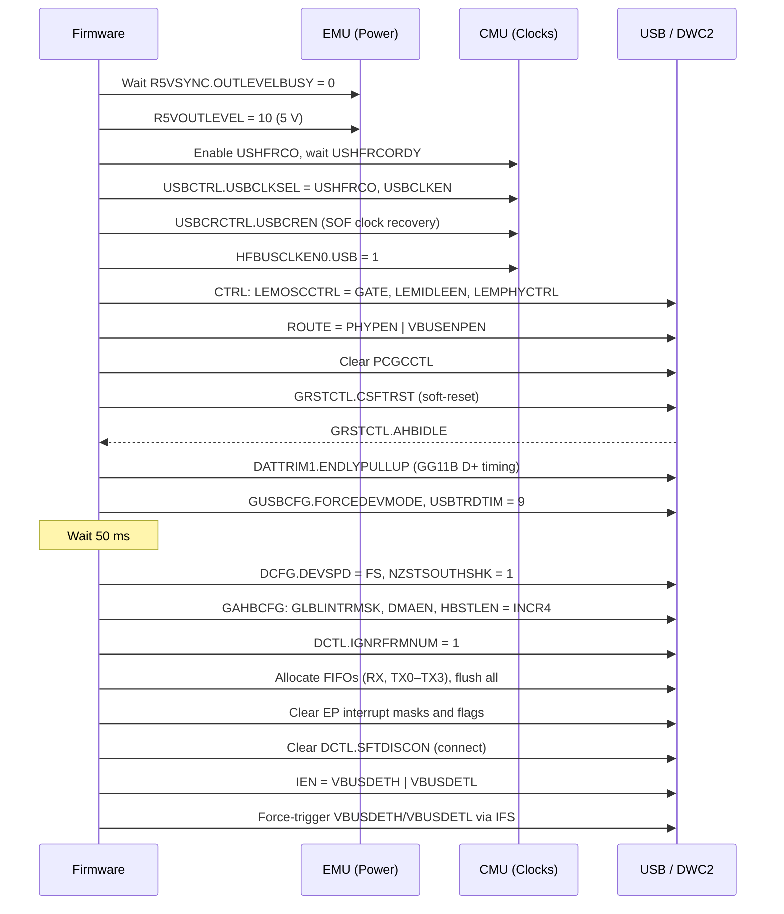
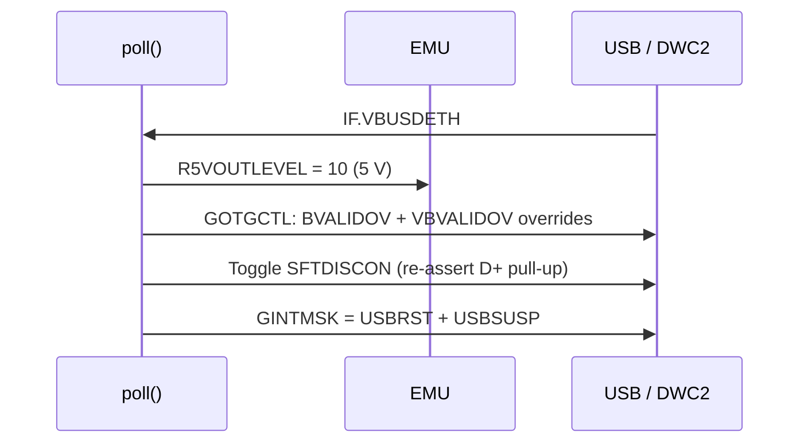
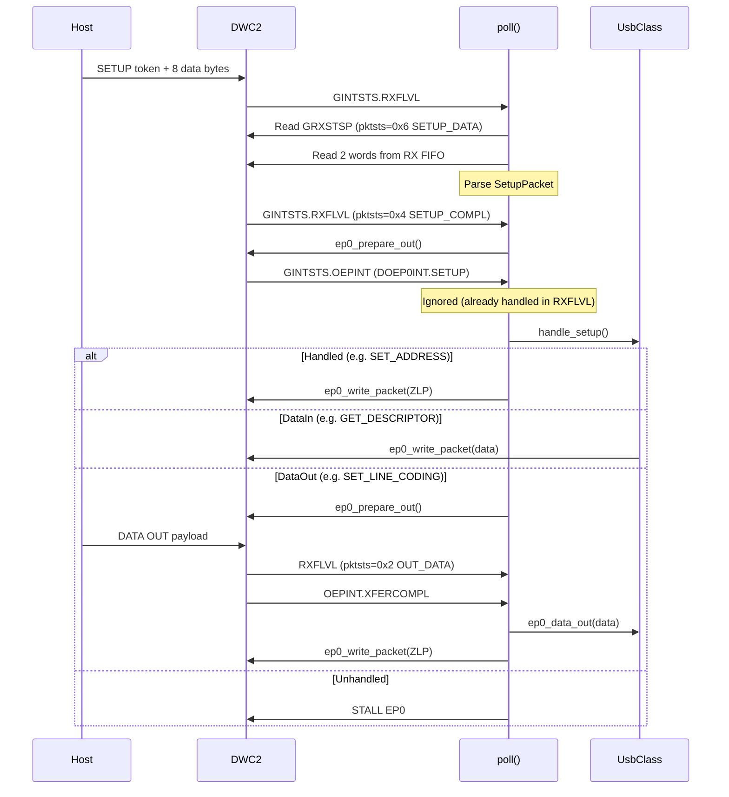
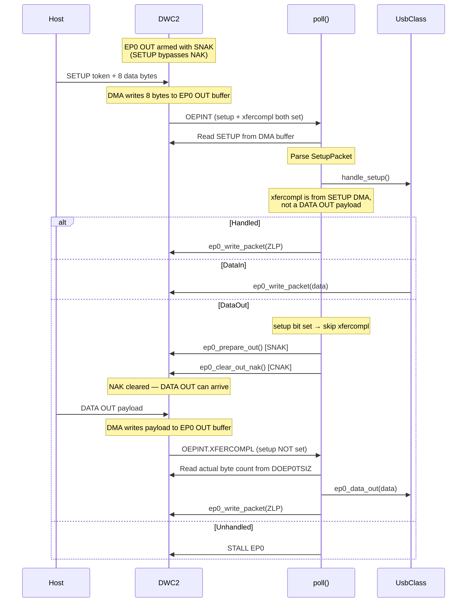
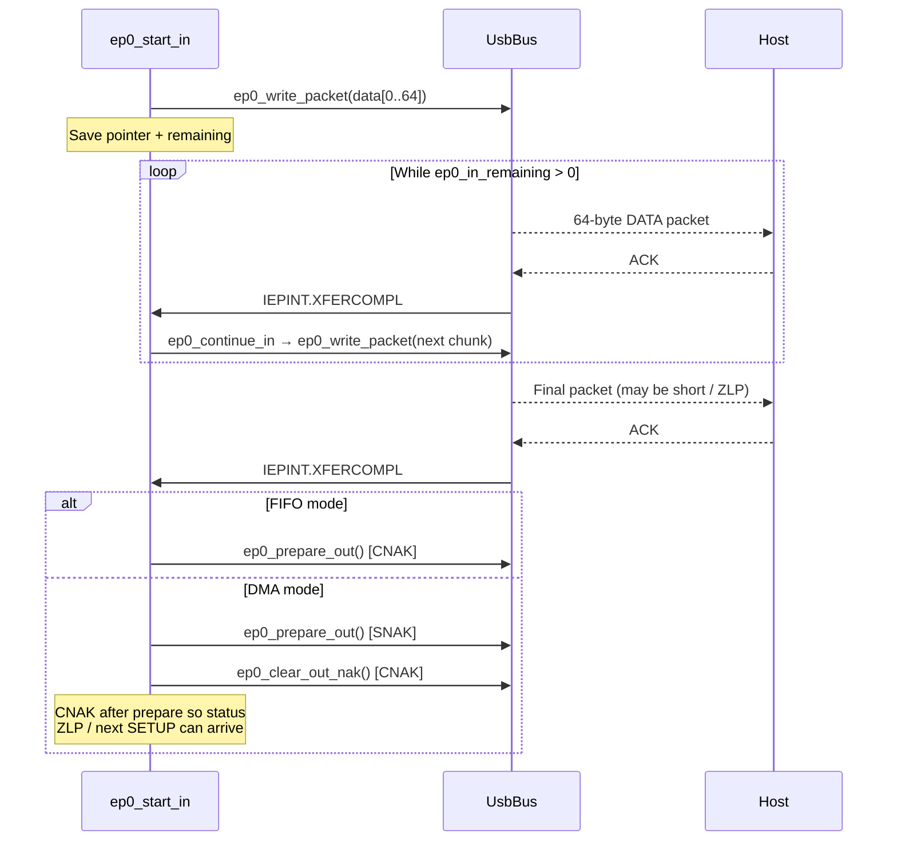
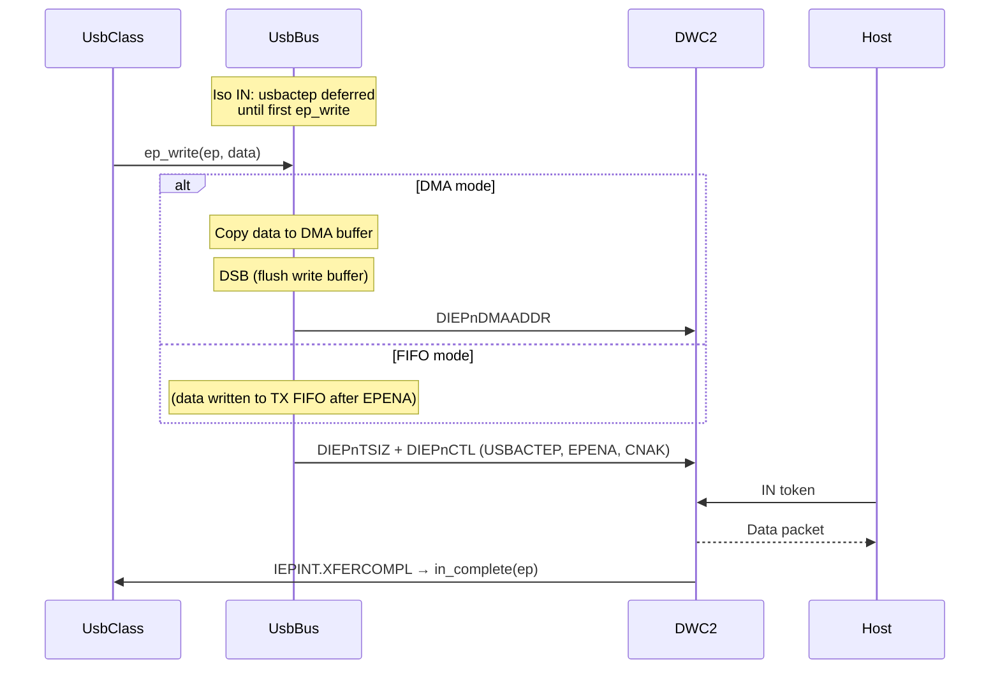
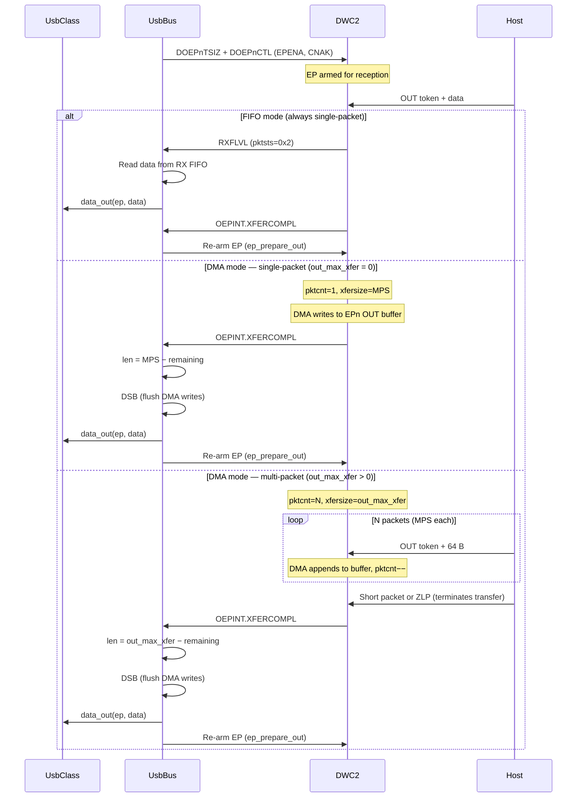
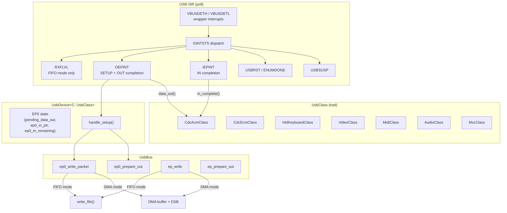

# efm32gg11b-usb — DWC2 USB Device Driver for EFM32GG11B

Bare-metal USB device driver for the EFM32 Giant Gecko 11 (Cortex-M4F, EFM32GG11B820F2048GL192).
Uses the on-chip DWC2 OTG core. Ported from `efm32hg322_usb`.

## Features

| Feature | Default | Description |
|---|---|---|
| `dma` | **yes** | Buffer DMA mode — the DWC2 core moves data between RAM and FIFOs autonomously, freeing the CPU during transfers. Uses ~4 KB of static DMA buffers. |

Without `dma`, the driver operates in slave (FIFO) mode: the CPU reads/writes
the DWC2 FIFOs directly inside the ISR.  This saves the static buffer memory
at the cost of higher interrupt overhead.

```toml
# Slave (FIFO) mode — saves ~4 KB of static RAM
efm32gg11b-usb = { version = "0.0.1", default-features = false }
```

## DWC2 on the EFM32GG11B

| Property | Value |
|---|---|
| Core | Cortex-M4F |
| USB peripheral base | `0x4002_2000` (EFM32 wrapper registers) |
| DWC2 core offset | `+0xDE000` (core at `0x4010_0000`) |
| FIFO base | `USB_BASE + 0xDF000 + ep * 0x1000` |
| Device endpoints | EP0–EP6 (7 total) |
| FIFO RAM | 512 words (2 KB) shared |
| Max packet size (EP0) | 64 bytes |
| PHY | Integrated FS-only |
| USB clock | USHFRCO 48 MHz with SOF clock recovery |
| DMA support | Yes — Buffer DMA mode via GAHBCFG.DMAEN |
| VBUS detection | `USB->STATUS.VBUSDETH` + `EMU->R5VSTATUS.VBUSDET` |
| OTG | Yes — OTG registers present (GOTGCTL), device-only use |
| D+ pull-up | `DCTL.SFTDISCON` (clear to connect, set to disconnect) |
| Power regulator | EMU R5V (5 V LDO with VBUS/VREGI input, VREGO output) |

## Key Differences from EFM32HG (efm32hg322_usb)

| Feature | EFM32HG | EFM32GG11B |
|---|---|---|
| **Register layout** | USB base = DWC2 base (`0x400C4000`) | USB wrapper at `0x40022000`, DWC2 at `+0xDE000` |
| **FIFO offset** | `base + 0x3D000` | `base + 0xDF000` |
| **Endpoints** | 3 (EP0–EP2) | 7 (EP0–EP6) |
| **FIFO RAM** | 256 words (1 KB) | 512 words (2 KB) |
| **D+ pull-up** | `USB->ROUTE.DMPUPEN` (explicit bit) | `DCTL.SFTDISCON` (standard DWC2 soft-disconnect) |
| **VBUS detect** | `USB->CTRL.VREGOSEN` + `STATUS.VREGOS` | `USB->STATUS.VBUSDETH` + `EMU->R5VSTATUS` |
| **VBUS flow** | Always-on (bus-powered) | Requires VBUSDETH interrupt + GOTGCTL overrides |
| **OTG registers** | Not present | Present; GOTGCTL BVALIDOV needed for D+ pullup |
| **Extra wrapper regs** | `IF`, `IEN`, `IFC`, `IFS` (basic) | `IF`, `IEN`, `IFC`, `IFS` with VBUSDETH/VBUSDETL bits |
| **EMU R5V** | Not present | Must set `R5VOUTLEVEL = 10` (5 V), wait `R5VSYNC` |
| **DATTRIM1** | Not present | Must set `ENDLYPULLUP` after every reset |
| **Power-on handshake** | Toggle `DCTL.PWRONPRGDONE` | Not used (Silicon Labs EMLIB omits it on GG11B) |
| **Clock tree** | `HFCORECLKEN0.USBC+USB+LE`, `CMD.USBCCLKSEL` | `CMU.USBCTRL.USBCLKSEL+USBCLKEN`, `HFBUSCLKEN0.USB` |
| **LEM** | `CTRL.LEMOSCCTRL = NONE` during init | `CTRL.LEMOSCCTRL = GATE`, `LEMIDLEEN`, `LEMPHYCTRL` |

### Why GOTGCTL overrides are required on GG11B

The EFM32GG11B has OTG-capable DWC2 silicon. The DWC2 core uses internal VBUS comparators to
set `GOTGCTL.BSESVLD` (B-session valid). On the GG11B, these comparators are not connected to
the actual VBUS pin — Silicon Labs routes VBUS sensing through the EMU R5V subsystem and the
USB wrapper's `STATUS.VBUSDETH` bit instead.

Without `GOTGCTL.BSESVLD = 1`, the DWC2 core does not apply the D+ pull-up even when
`DCTL.SFTDISCON = 0`. The driver must set GOTGCTL overrides (`BVALIDOVEN + BVALIDOVVAL +
VBVALIDOVEN + VBVALIDOVVAL`) when `VBUSDETH` fires to force the core into active device mode.

### SLSTK3701A board setup

The SLSTK3701A starter kit has a 3-position power selector switch (BAT / USB / AEM):

- **AEM** (default): MCU powered from debug USB via LDO. VBUS from Micro-AB does NOT reach MCU.
- **USB**: MCU powered from Micro-AB via R5V regulator. Required for USB device mode.
- **BAT**: MCU powered from CR2032 coin cell.

For USB device mode: set switch to **USB**, connect debug USB (Type-C) for flashing,
and connect a second cable to the **USB Micro-AB** connector.

## EFM32GG11B-specific Init Sequence



Then in the VBUSDETH handler:



## SETUP Packet Flow — FIFO (Slave) Mode



## SETUP Packet Flow — DMA Mode

EP0 OUT is always armed with **SNAK** so that only SETUP packets (which
bypass NAK on the DWC2) can arrive.  DATA OUT is gated by an explicit
`ep0_clear_out_nak()` call after the SETUP has been read and processed,
preventing a host DATA OUT from overwriting the SETUP data in the shared
DMA buffer before the ISR can parse it.



## Multi-Packet EP0 IN Transfer

`DIEP0TSIZ.xfersize` is only 7 bits wide (max 127), so descriptors
larger than 64 bytes must be sent one packet at a time in both modes.



## IN Transfer Flow (EPn)

Isochronous IN endpoints are activated with `usbactep` deferred: the bit
is **not** set in `activate_endpoints()` so the DWC2 NAKs host IN tokens
until the first `ep_write()` supplies real data.  This prevents the
controller from transmitting stale/zero data (which appears as a green
flash in YUY2 video).



## OUT Transfer Flow (EPn)

Each endpoint's `EpConfig.out_max_xfer` controls how the OUT side is armed:

| `out_max_xfer` | Behaviour | Use case |
|---|---|---|
| `0` | Single-packet: `pktcnt=1, xfersize=MPS` | CDC-ACM, MSC, MIDI — one packet per XFERCOMPL |
| `> 0` | Multi-packet: `pktcnt=max_xfer/MPS, xfersize=max_xfer` | CDC-ECM — receive a full Ethernet frame (up to 1536 B) in one DMA transfer |

Multi-packet mode eliminates per-packet NAK/ISR round-trips that otherwise
add ~1 ms latency per 64-byte packet at Full Speed (one USB frame per NAK).
The transfer completes when the host sends a short packet or ZLP.



## Architecture


